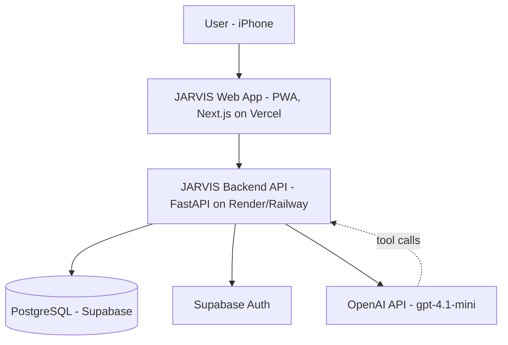
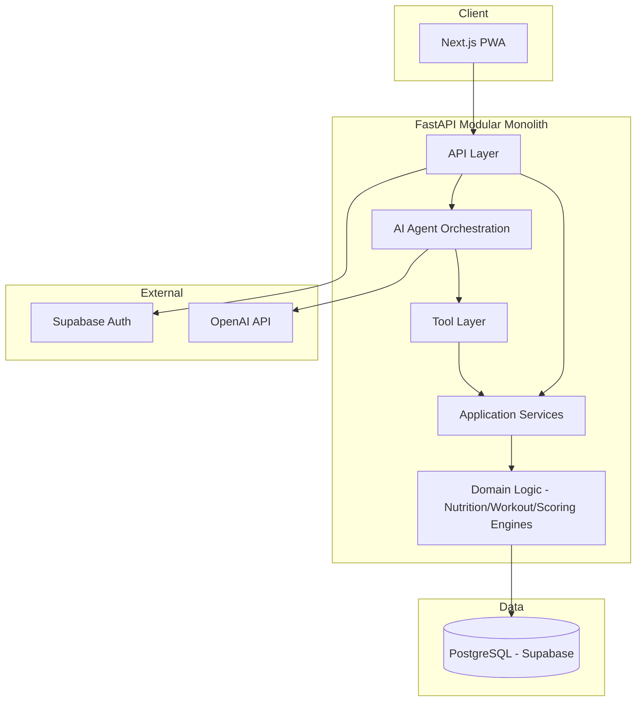
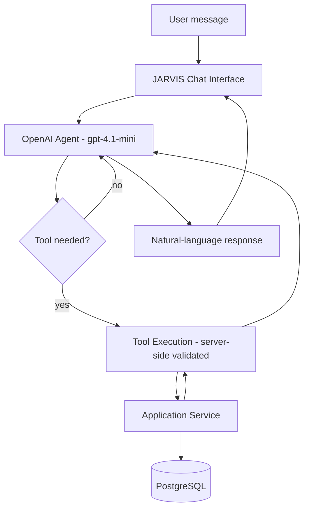
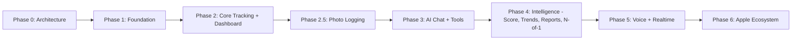
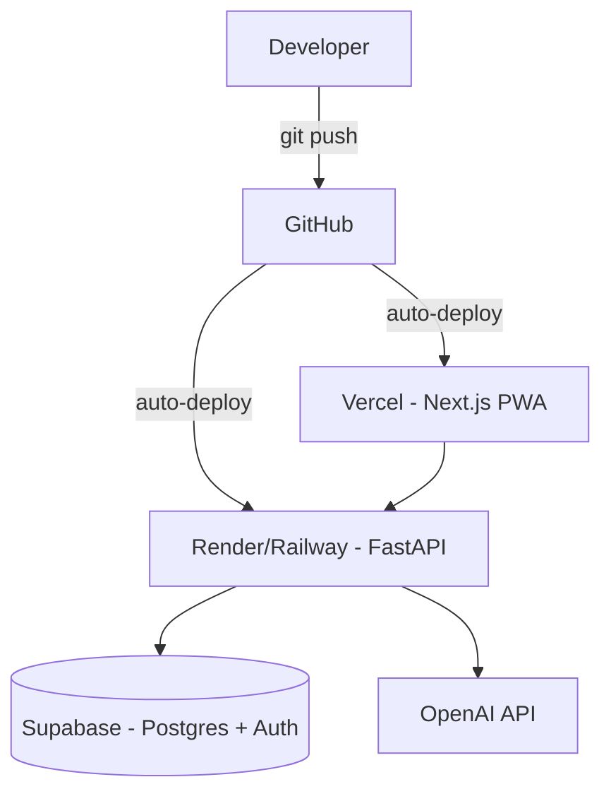

# JARVIS — Personal Health & Fitness AI Agent
## Project Initialization & High-Level Design Report

**Status:** Approved for implementation
**Owner:** Solo developer
**Budget constraint:** Near-$0 infrastructure spend; ~$5 OpenAI credit as initial AI budget

---

## 1. Executive Summary

JARVIS is a personal health and fitness operating system with an AI agent layered on top of a structured data and analytics platform — not a chatbot bolted onto a tracker. The system's core principle: **structured data and deterministic business logic are the source of truth; the LLM interprets, explains, and orchestrates tools, but never calculates, invents, or stores facts on its own.**

This report defines the MVP, the architecture, the database, the API, the AI tool layer, and the roadmap for a solo developer building this as both a real personal tool and a portfolio-quality system, operated at effectively zero infrastructure cost and a small, disciplined OpenAI budget.

---

## 2. Product Vision

JARVIS tracks nutrition, workouts, body metrics, and (later) activity/sleep, and lets the user interrogate and act on that data in natural language. Long-term it produces personalized recommendations, weekly reports, trend detection, and supports N-of-1 self-experiments — all built on deterministic calculations that the AI narrates rather than performs.

---

## 3. Problem Statement

Existing fitness apps are either rigid trackers with no intelligence, or AI chat wrappers with no reliable data backbone (and therefore no trustworthy numbers). There's no personal system that combines fast natural-language logging with a deterministic, auditable analytics core and genuinely useful, non-hallucinated AI reasoning on top of it.

---

## 4. Goals

- Fast, low-friction logging (text and, soon, photo) for meals and workouts
- A single source of truth for nutrition/workout/body data in Postgres
- AI as an interface and reasoning layer, never as a calculator or data store
- A system that can evolve from single-user to multi-user without a rewrite
- A portfolio-credible demonstration of full-stack + AI agent engineering
- Near-zero recurring cost while validating the product

## 5. Non-Goals (MVP)

- Not building a multi-user SaaS product yet (architecture supports it later; MVP doesn't need it)
- Not doing medical diagnosis or clinical advice
- Not building native iOS, HealthKit, or Apple Watch integration yet
- Not doing voice or Realtime API integration yet
- Not building a vector database / semantic memory store
- Not multi-model routing or elaborate cost-optimization infra — one cheap model, used carefully

---

## 6. Primary User

A single technical user (the developer) tracking their own nutrition, training, and body metrics daily on an iPhone via a mobile-first web app, occasionally asking JARVIS questions in natural language.

---

## 7. Core User Journeys

1. **Log a meal by text:** "2 eggs, 4 idlis, a banana" → parsed → resolved against food DB → nutrition calculated → stored → dashboard updates.
2. **Log a meal by photo (Phase 2.5):** photo → vision model estimates foods/portions → user confirms/edits → same nutrition pipeline as text.
3. **Log a workout by text:** "3 sets of pull-ups, 8 reps each" → structured workout record.
4. **Ask JARVIS a question:** "How much protein do I have left today?" → AI calls `calculate_remaining_macros` tool → backend computes → AI explains in plain language.
5. **Check the dashboard:** today's calories/protein/meals/workout, recent weight, weekly summary — all deterministic, no AI call needed.
6. **Review long-term memory:** goals, equipment, preferences that persist across sessions and inform recommendations.

---

## 8. MVP Scope

**Included:**
- Auth (Supabase Auth), user profile, goals
- Food DB, meals, meal items, daily nutrition totals
- Workout sessions, exercises, sets/reps/weight, workout history
- Body weight + basic measurements, historical tracking
- Dashboard (deterministic, no AI dependency)
- AI chat with a small, high-value tool set (see §14)
- Text-based meal/workout logging via AI parsing → deterministic backend resolution
- Structured long-term memory (goals, equipment, preferences)

**Explicitly excluded from MVP**, sequenced later:
- Food photo logging → **Phase 2.5** (right after core tracking + dashboard are proven)
- Trend detection, weekly reports, health score, what-if simulator, N-of-1 experiments → **Phase 4**
- Voice, Realtime API → **Phase 5**
- Apple Health / HealthKit / Apple Watch → **Phase 6**

---

## 9. Future Scope

See §30 (Development Phases) for the full sequencing. Everything in the original vision (health score, trend detection, N-of-1 experiments, what-if simulator, voice, Apple ecosystem) remains part of the long-term product — none of it is cut, only sequenced after the deterministic foundation and core logging loop are solid.

---

## 10. Functional Requirements (MVP)

- User can register/log in (Supabase Auth)
- User can set/update goals (calorie/macro targets)
- User can log a meal via free-text natural language
- User can log a workout via free-text natural language
- User can view today's nutrition totals and remaining macros
- User can view workout history
- User can log/view body weight over time
- User can view a dashboard summarizing the above
- User can ask JARVIS natural-language questions about their own data, answered only via tool calls against real data
- User can store and retrieve structured memory (goals, equipment, preferences)
- Destructive AI-initiated actions require explicit confirmation

## 11. Non-Functional Requirements

Realistic targets for a solo personal project, not enterprise SLAs:

| Attribute | Target |
|---|---|
| Availability | Best-effort; free-tier cold starts acceptable (few-second delay tolerable) |
| Performance | Dashboard/API calls <500ms warm; AI calls <5s |
| Security | Auth required on all endpoints; least-privilege data sent to AI; secrets in env vars, never committed |
| Scalability | Single-user now; schema supports multi-tenant later without migration rewrite |
| Cost | ~$0/month infra (free tiers); AI spend tracked and capped |
| Maintainability | Modular monolith, clear service boundaries, typed contracts (TS + Pydantic) |
| Accessibility | Basic mobile-first usability; not a WCAG audit target for MVP |
| Observability | Basic error/latency/token-usage logging from day one |

---

## 12. System Context



---

## 13. High-Level Architecture



Key point: the AI agent's tools call into the **same application services** that the REST API uses. There is no separate code path for "AI writes data" vs "user writes data" — both go through identical validated service functions.

---

## 14. Component Architecture

- **API Layer:** FastAPI routers, request validation (Pydantic), auth middleware
- **Application Services:** meal service, workout service, nutrition service, body-metrics service, memory service — each owns its table(s) and enforces business rules
- **Domain/Engine Logic:** deterministic nutrition calculator, deterministic workout aggregator (later: scoring engine, trend engine) — pure functions, unit-testable in isolation, no AI dependency
- **AI Agent Orchestration:** builds the tool-enabled OpenAI request, manages the conversation turn, validates tool-call arguments server-side before execution
- **Tool Layer:** thin adapters that map an OpenAI tool call to an application service call, enforcing auth/ownership checks independently of anything the model asserts

---

## 15. AI Agent Architecture



The model **selects** tools; it never executes logic itself. Every tool call is re-validated against the authenticated user's ownership of the requested resource before the service layer runs.

---

## 16. Data Architecture

```
Raw structured input (text/photo)
        ↓
AI parsing → structured JSON (foods, quantities / sets, reps, weight)
        ↓
Server-side validation + resolution against reference data (food DB, exercise DB)
        ↓
Deterministic calculation (nutrition engine / workout aggregator)
        ↓
PostgreSQL (source of truth)
        ↓
Deterministic aggregation (daily/weekly totals)
        ↓
AI explanation layer (on request only)
```

---

## 17. Database Design

Postgres (Supabase), UUID primary keys, `created_at`/`updated_at` on all tables, soft-delete (`deleted_at`) on user-generated content (meals, workouts, body metrics) so nothing is destructively lost from a misfired AI write.

### Core tables (MVP)

**users** — managed by Supabase Auth; app-side `user_profiles` extends it.

**user_profiles**
`id (PK, = auth.users.id)`, `display_name`, `timezone`, `created_at`, `updated_at`

**goals**
`id (PK)`, `user_id (FK)`, `calorie_target`, `protein_target_g`, `carb_target_g`, `fat_target_g`, `weight_goal_kg`, `active (bool)`, `created_at`
*Index:* `(user_id, active)`

**foods**
`id (PK)`, `name`, `source (enum: verified/user_created/ai_estimated)`, `default_serving_id (FK, nullable)`, `created_at`
*Constraint:* unique `(name, source)` to reduce duplicate entries

**food_servings**
`id (PK)`, `food_id (FK)`, `serving_description` (e.g. "1 idli", "100g"), `calories`, `protein_g`, `carbs_g`, `fat_g`, `fiber_g`
*Index:* `food_id`

**meals**
`id (PK)`, `user_id (FK)`, `logged_at (timestamptz)`, `meal_type (enum: breakfast/lunch/dinner/snack)`, `input_source (enum: text/photo/manual)`, `raw_input (text, nullable)`, `deleted_at`
*Index:* `(user_id, logged_at)`

**meal_items**
`id (PK)`, `meal_id (FK)`, `food_id (FK)`, `serving_id (FK)`, `quantity (numeric)`, `nutrition_confidence (enum: verified/estimated)`, `calories/protein_g/carbs_g/fat_g/fiber_g` (denormalized snapshot at log time — see §19)

**exercises**
`id (PK)`, `name`, `category (enum: strength/cardio/mobility/other)`, `created_at`

**workout_sessions**
`id (PK)`, `user_id (FK)`, `started_at`, `ended_at (nullable)`, `notes`, `deleted_at`
*Index:* `(user_id, started_at)`

**workout_exercises**
`id (PK)`, `session_id (FK)`, `exercise_id (FK)`, `order_index`

**workout_sets**
`id (PK)`, `workout_exercise_id (FK)`, `set_number`, `reps`, `weight_kg (nullable)`, `duration_seconds (nullable)`

**body_metrics**
`id (PK)`, `user_id (FK)`, `recorded_at`, `metric_type (enum: weight/waist/chest/...)`, `value`, `unit`, `deleted_at`
*Index:* `(user_id, metric_type, recorded_at)`

**user_memory**
`id (PK)`, `user_id (FK)`, `category (enum: goal/equipment/preference/constraint/observation)`, `key`, `value`, `created_at`, `updated_at`
*Index:* `(user_id, category)`
*Note:* plain relational key/value — no vector store needed at this scale (ADR-010).

**daily_summaries** (materialized/cached aggregation, computed nightly or on-read)
`user_id (FK)`, `date`, `total_calories`, `total_protein_g`, `total_carbs_g`, `total_fat_g`, `workout_completed (bool)`
*Primary key:* `(user_id, date)`

### Deferred to later phases
`sleep_records`, `activity_records` (Phase 6 / Apple Health), `experiments`, `experiment_metrics` (Phase 4), `user_preferences` folded into `user_memory` for MVP rather than a separate table (fewer moving parts; split out later only if it proves necessary).

---

## 18. Database Design Principles

- UUIDs for all primary keys (safe for eventual multi-tenant use, no ID-guessing)
- `created_at`/`updated_at` on every table; soft delete on user-generated content
- Foreign keys enforced at the DB level, not just application level
- No important structured data lives only in JSON — `user_memory` uses typed columns (`category`, `key`, `value`) rather than a JSON blob, so it's queryable and indexable
- Nutrition values on `meal_items` are **snapshotted at log time**, not just referenced live from `food_servings` — if a food's reference data is corrected later, historical logs stay accurate to what was actually calculated and shown to the user at the time

---

## 19. API Architecture

Base: `/api/v1`. All endpoints require a valid Supabase Auth JWT except `/auth/*`.

| Method | Path | Purpose |
|---|---|---|
| `GET` | `/users/me` | Current user profile |
| `GET/POST` | `/goals` | View/set active goals |
| `GET/POST` | `/foods` | Search/create foods |
| `GET/POST` | `/meals` | List/log meals |
| `DELETE` | `/meals/{id}` | Soft-delete a meal |
| `GET` | `/nutrition/daily` | Today's deterministic totals |
| `GET` | `/nutrition/weekly` | 7-day deterministic aggregation |
| `GET/POST` | `/workouts` | List/log workout sessions |
| `GET/POST` | `/exercises` | List/create exercises |
| `GET/POST` | `/body-metrics` | List/log body metrics |
| `GET` | `/dashboard` | Aggregated dashboard payload |
| `POST` | `/ai/chat` | AI conversation turn (tool-calling enabled) |

**Example — `POST /meals`:**
Request: `{ "input_source": "text", "raw_input": "2 eggs and 4 idlis", "logged_at": "...", "meal_type": "breakfast" }`
Flow: text goes through the AI parser *only* to extract structured food+quantity JSON → backend resolves against `foods`/`food_servings` → nutrition engine computes → row(s) inserted → response returns the resolved, calculated meal.
Errors: unresolvable food → `422` with a clear "food not found, please create it or clarify" message (never silently guessed).

**Example — `POST /ai/chat`:**
Request: `{ "message": "how much protein do I have left today?" }`
Flow: message → agent → tool call `calculate_remaining_macros(user_id)` (server injects `user_id` from JWT, never trusts the model to supply it) → deterministic result → agent phrases response.
Response includes which tool(s) were called, for debuggability.

---

## 20. Frontend Architecture

**Pages:** Dashboard, Meals, Meal Detail, Workouts, Workout Detail, Progress (weight/measurements), Goals, JARVIS (chat), Settings.

- **Routing:** Next.js App Router
- **State:** server state via React Query (or SWR) against the FastAPI backend; minimal client-only state (form drafts, chat scroll position) in local component state
- **API communication:** typed client generated from FastAPI's OpenAPI schema, shared types in a `packages/types` workspace package
- **Loading/error states:** every data-fetching view has explicit skeleton/loading and error-boundary states — non-negotiable for a logging app people actually rely on daily
- **Forms:** client-side validation mirrors backend Pydantic constraints; server is still the final authority
- **Mobile-first:** single-column layouts, large tap targets, bottom-anchored quick-log entry point (the "2 eggs and 4 idlis" text box should be one tap away from anywhere in the app)

---

## 21. iPhone Strategy

**PWA first**, not native — installable to Home Screen, works in Safari, no App Store friction, no Apple Developer account needed to start. SwiftUI + HealthKit + Apple Watch is explicitly a **Phase 6** decision, revisited only once the core product is proven and Apple Health data (steps/sleep/heart rate) becomes a real value-add rather than a nice-to-have.

---

## 22. Nutrition Engine

```
Food + quantity + serving reference
        ↓
Nutrition Calculator (pure deterministic function)
        ↓
calories, protein, carbs, fat, fiber
```

The AI's only job is turning "2 eggs, 4 idlis, a banana" into structured JSON: `[{food: "egg", qty: 2, unit: "whole"}, {food: "idli", qty: 4, unit: "whole"}, {food: "banana", qty: 1, unit: "whole"}]`. Everything after that — resolving against `foods`/`food_servings`, handling ambiguity, doing the arithmetic — is backend code. Indian household foods (idli, dosa, roti, dal, etc.) get first-class support in the seed food database with household-measurement servings (e.g., "1 idli", "1 katori") rather than forcing gram-based entry.

Nutrition values carry a `confidence` marker: `verified` (from a real food DB entry) or `estimated` (AI/vision-derived, unconfirmed) — surfaced in the UI, never silently presented as exact.

---

## 23. Workout Engine

Deterministic aggregation only: total volume (sets × reps × weight), session duration, workout frequency over a window, per-exercise progression (weight/reps over time). The AI parses "3 sets of pull-ups, 8 reps each" into structured `workout_sets` rows; all math on top of that is backend code, same principle as the nutrition engine.

---

## 24. Analytics Engine (Phase 4 foundation, designed now)

```
Raw data → Aggregation → Metrics → Trend detection → AI explanation
```

Deterministic: 7-day rolling averages (weight, protein, calories), workout frequency/volume, calorie adherence rate, consistency streaks. The AI layer only ever *narrates* these numbers and is explicitly instructed to use correlational, not causal, language (e.g., "workout performance appears higher following longer sleep," never "sleep causes better workouts").

---

## 25. Memory Architecture

- **Short-term:** current conversation turn(s), not persisted beyond the session
- **Structured long-term memory:** `user_memory` table — goals, equipment, preferences, constraints, as typed key/value rows per category (§17)
- **Historical observations** (Phase 4+): derived facts like "protein has averaged below target for 3 weeks" — computed by the analytics engine, stored the same way as other memory, not invented by the LLM

No vector database (ADR-010) — at single-user scale with a few dozen memory facts, relational lookup is simpler, cheaper, and fully auditable. Revisit only if/when semantic search over large unstructured text (e.g., years of free-text notes) becomes a real need.

---

## 26. Security & Privacy

- Supabase Auth for authentication; JWT validated on every backend request
- Row-level ownership enforced in application services (never trust `user_id` from client or model input — always derive from the authenticated session)
- Encryption in transit (HTTPS everywhere, enforced by Vercel/Render/Supabase defaults)
- Encryption at rest (Supabase-managed)
- Secrets (OpenAI key, DB credentials) in environment variables only, never committed
- Minimum-necessary data sent to the AI — tool results return only the fields relevant to the query, not full user records
- No sensitive health data in logs/observability tooling beyond what's needed to debug (e.g., log "meal logging failed for user X, reason: Y," not the meal contents)
- Data export/deletion: a simple `/users/me/export` and account-deletion path, even at MVP, given the sensitivity of health data

---

## 27. AI Safety & Prompt Injection

- The model **never** receives raw authority to write data — every tool call is re-validated server-side (ownership, input shape, business rules) before touching the database
- Treat any user-supplied text (meal descriptions, chat messages) as untrusted input that could contain injected instructions; the system prompt explicitly instructs the model to treat food/workout descriptions as data, not instructions
- If information is unavailable, the required response is "I don't have enough data to determine that" — never an invented number
- No medical diagnosis; wellness language only, with a standing disclaimer that JARVIS is not a medical provider
- Destructive actions (delete meal/workout) always require explicit user confirmation before the tool executes

---

## 28. Observability

Lightweight from day one: request latency and error logging (structured logs, e.g. via FastAPI middleware), AI call latency and **token usage per call** (critical given the budget constraint — log input/output tokens and estimated cost per `/ai/chat` call), tool call success/failure counts, DB error logging. No sensitive health values in log payloads.

---

## 29. Testing Strategy

- **Unit tests:** nutrition calculator, workout aggregator, (later) scoring/trend functions — pure functions, high coverage expected
- **Integration tests:** meal logging end-to-end (text → parse → resolve → store → dashboard reflects it), workout logging end-to-end, auth-protected endpoint access control
- **AI evaluation suite** (small but real):
  - "What's my protein today?" → expect `get_daily_nutrition` tool call, no invented numbers
  - "Delete yesterday's meals" → expect confirmation step before any delete tool executes
  - Question about non-existent data → expect "I don't have enough data," not a fabricated answer
  - Ambiguous food ("some rice") → expect a clarifying question or an explicit `estimated` confidence marker, not silent invention of a portion size

---

## 30. Development Phases



- **Phase 0 — Architecture:** this document (done)
- **Phase 1 — Foundation:** repo scaffold, Next.js + FastAPI skeletons, Supabase project (DB + Auth), Vercel + Render deploy pipelines wired up, empty but deployed end-to-end
- **Phase 2 — Core Tracking:** meals, nutrition engine, workouts, body metrics, dashboard — all deterministic, zero AI dependency, fully usable on its own
- **Phase 2.5 — Photo Logging:** vision-based meal parsing feeding the same nutrition engine, once text logging is proven stable
- **Phase 3 — AI:** JARVIS chat, trimmed MVP tool set (§31), structured outputs for parsing, `user_memory` wired in
- **Phase 4 — Intelligence:** health score, trend detection, weekly reports, what-if simulator, N-of-1 experiments
- **Phase 5 — Multimodal continued:** voice, Realtime API
- **Phase 6 — Apple ecosystem:** HealthKit, Apple Watch, native considerations

---

## 31. MVP AI Tool Set

Trimmed from the original 18 to the smallest set that delivers real value without depending on not-yet-built engines:

| Tool | Type | Notes |
|---|---|---|
| `get_daily_nutrition` | Read | Deterministic query, no AI math |
| `log_meal` | Write | Text → structured JSON → backend resolves & calculates |
| `get_workout_history` | Read | |
| `log_workout` | Write | Text → structured JSON → backend stores |
| `calculate_remaining_macros` | Read | Pure backend calculation, AI just explains it |
| `get_user_memory` | Read | Goals/preferences/equipment context for recommendations |

Everything else (`get_trends`, `run_what_if`, `create_meal_plan`, `create_workout_plan`, `get_weekly_summary`) is deferred to Phase 3+/4, added only once the deterministic engine behind each exists — building the tool ahead of its engine is exactly the kind of thing that invites hallucination.

---

## 32. Repository Structure

```
jarvis/
├── apps/
│   ├── web/           # Next.js PWA
│   └── api/            # FastAPI backend
├── packages/
│   └── types/           # shared TS types generated from OpenAPI schema
├── docs/
│   ├── architecture/    # this document, diagrams
│   ├── api/
│   ├── database/
│   └── decisions/        # ADRs
├── tests/
├── scripts/
├── .github/
└── README.md
```

---

## 33. Deployment Architecture



All free tier: Vercel (frontend), Render or Railway (backend, cold-start accepted), Supabase (DB + Auth). No custom infra, no containerization complexity beyond what the platforms handle automatically.

---

## 34. Cost Strategy

**Infra:** $0/month at MVP scale on free tiers across Vercel, Render/Railway, and Supabase.

**AI:** `gpt-4.1-mini` for all calls (parsing and chat) at MVP — no multi-model routing until real usage data justifies it. Cost levers, in priority order:
1. Keep the MVP tool schema small (§31) — tool definitions are sent on every chat call and cost tokens regardless of whether they're used
2. Serve deterministic queries (dashboard, "what did I eat today") directly from the backend without an AI call whenever the frontend can just call the REST endpoint instead of routing through chat
3. Compress meal photos client-side before any vision call (Phase 2.5)
4. Log token usage per call from day one (§28) so actual cost-per-log is known, not guessed
5. No retry loops on low-confidence AI output — surface it to the user for a cheap manual correction instead of re-calling the model

**Rough logic (to refine with real numbers once built):** a text meal-parse call is small (short input, short structured output) — the $5 credit should comfortably cover weeks of daily logging plus chat Q&A during MVP development and validation, provided tool schemas stay lean and the dashboard doesn't route through AI unnecessarily.

---

## 35. Design Decision Records

**ADR-001: Modular Monolith over Microservices**
*Context:* solo developer, single-user MVP. *Decision:* one FastAPI service with clear internal module boundaries. *Alternatives:* microservices. *Reasons:* zero deployment/ops overhead, no network-call complexity between services. *Trade-offs:* less independent scalability, acceptable at this scale. *Revisit:* if the system grows to multiple independently-scaling teams/services, which is not a near-term prospect.

**ADR-002: Next.js for Frontend**
*Decision:* Next.js/React/TypeScript. *Alternatives:* plain React SPA, SvelteKit. *Reasons:* best PWA support, Vercel-native deploy, largest ecosystem for a solo dev to lean on. *Trade-offs:* heavier framework than strictly necessary. *Revisit:* not expected to.

**ADR-003: FastAPI for Backend**
*Decision:* Python/FastAPI. *Alternatives:* Node/Express, Django. *Reasons:* excellent typed request validation (Pydantic), natural fit for AI/tool-calling code (Python OpenAI SDK is first-class), async support. *Trade-offs:* two languages in the stack (TS + Python) vs. a full-TS stack. *Revisit:* if AI orchestration moves client-side, which isn't planned.

**ADR-004: PostgreSQL as Source of Truth**
*Decision:* single Postgres DB (Supabase-hosted) for all structured data. *Alternatives:* polyglot persistence, NoSQL. *Reasons:* relational integrity matters for health data; one DB is simplest to operate solo. *Trade-offs:* none material at this scale. *Revisit:* only at genuine multi-tenant scale.

**ADR-005: PWA before Native iOS**
*Decision:* PWA for MVP. *Alternatives:* SwiftUI native app immediately. *Reasons:* no App Store friction, single codebase, fast iteration; HealthKit isn't needed until Phase 6 anyway. *Trade-offs:* no deep HealthKit integration until native is built. *Revisit:* Phase 6, once Apple Health data is a proven value-add.

**ADR-006: Supabase Auth + Supabase Postgres (bundled)**
*Decision:* use Supabase for both auth and DB hosting rather than mixing vendors (e.g., Auth.js + Railway Postgres). *Alternatives:* Auth.js with self-managed user tables. *Reasons:* one vendor, one dashboard, free tier covers MVP entirely, RLS composes naturally with Postgres policies for future multi-tenant support. *Trade-offs:* vendor coupling. *Revisit:* if Supabase pricing/limits become a blocker at scale.

**ADR-007: `gpt-4.1-mini` Only, No Multi-Model Routing at MVP**
*Decision:* single cheap model for all AI calls. *Alternatives:* route reasoning calls to a stronger model. *Reasons:* budget constraint, unknown usage pattern until real data exists. *Trade-offs:* possibly lower-quality reasoning on complex questions. *Revisit:* once token-usage logging (§28) shows where quality actually suffers.

**ADR-008: Deterministic Nutrition & Workout Engines**
*Decision:* all arithmetic (calories, macros, volume, aggregates) in backend code, never in the LLM. *Reasons:* correctness, auditability, trust — the entire premise of the product. *Trade-offs:* more backend code to write up front. *Revisit:* never, this is a core product principle.

**ADR-009: Read/Write Tool Separation with Confirmation on Destructive Writes**
*Decision:* MVP tools split into read (§31) and a small set of validated writes; deletions require explicit user confirmation before execution. *Reasons:* AI security boundary — the model selects intent, the backend enforces authorization and consequence. *Trade-offs:* slightly more conversational friction on destructive actions, acceptable given the stakes.

**ADR-010: Relational Memory, No Vector Database**
*Decision:* `user_memory` as typed relational rows. *Alternatives:* vector store for semantic recall. *Reasons:* small, structured fact set at single-user scale doesn't need semantic search; relational is simpler, cheaper, auditable. *Trade-offs:* won't scale to unstructured free-text memory at volume. *Revisit:* if/when memory grows into large unstructured notes needing semantic retrieval.

**ADR-011: Photo Logging Sequenced to Phase 2.5, Not MVP or Phase 5**
*Decision:* build text logging first, prove the pipeline, then add photo input to the *same* nutrition engine shortly after. *Reasons:* avoids debugging two unproven input pipelines simultaneously; contains AI iteration cost to the cheaper text path first. *Trade-offs:* a genuinely differentiating feature ships slightly later than day one. *Revisit:* not needed — this is a sequencing decision, not a scope cut.

**ADR-012: Privacy-by-Design**
*Decision:* least-privilege data to AI, no sensitive data in logs, soft-delete on user content, export/delete endpoints from MVP. *Reasons:* health data sensitivity. *Trade-offs:* minor extra implementation work up front, worth it.

---

## 36. Risks & Mitigations

| Risk | Mitigation |
|---|---|
| OpenAI credit exhausted mid-development | Token-usage logging from day one (§28); lean tool schemas; deterministic-first design |
| Free-tier backend cold starts hurt UX | Accept for MVP (personal use, few checks/day); revisit paid tier only if it becomes a real annoyance |
| Food database gaps (esp. Indian home-cooked meals) | Seed DB manually with common items; `estimated`/`user_created` food source lets the system degrade gracefully to user-entered data |
| Scope creep into Phase 4+ features before MVP loop is proven | Roadmap discipline (§30); this document as the standing reference for what's in vs. out |
| Vision costs creeping if iteration is heavy in Phase 2.5 | Client-side image compression; no retry loops; text pipeline absorbs most iteration cost first |
| Vendor lock-in (Supabase) | Standard Postgres underneath — migration path exists if ever needed, just not a near-term concern |

---

## 37. Testing/Evaluation Strategy Summary

Covered in detail in §29: unit tests on all deterministic engines, integration tests on the full logging pipelines, and a small but real AI evaluation suite that checks for hallucination avoidance, correct tool selection, and confirmation-gating on destructive actions. This evaluation suite is itself a portfolio artifact worth documenting well.

---

## 38. Resume / Portfolio Positioning

JARVIS demonstrates: full-stack TypeScript + Python engineering, relational schema design for a real (non-toy) domain, REST API design, AI agent architecture with disciplined tool-calling and server-side authorization (a genuinely differentiating detail most portfolio AI projects skip), multimodal input handling, deterministic-vs-AI separation as an explicit architectural principle, cost-aware system design, and a documented ADR trail showing engineering judgment — not just a feature list.

---

## 39. Final Architecture Summary

Structured data in Postgres is the only source of truth. FastAPI enforces validation and authorization independently of the AI at every layer. The AI's role is narrow and consistent throughout: parse natural language into structured input, select the right tool, and explain deterministic results in plain language — never calculate, never invent, never act without server-side validation. The stack (Next.js/Vercel, FastAPI/Render, Supabase) runs at $0 infrastructure cost, with `gpt-4.1-mini` as the sole AI model until real usage data justifies anything more expensive. Photo logging is a real, prioritized feature, sequenced right after the text-logging foundation is proven rather than bundled into either MVP or a distant future phase.

---

## 40. Recommended Next Step

**Build Phase 1 (Foundation) end-to-end before writing any tracking features:**

1. Scaffold the monorepo (`apps/web`, `apps/api`, `packages/types`)
2. Create the Supabase project (DB + Auth), apply the MVP schema from §17 as an initial migration
3. Wire up Supabase Auth in both frontend (login/session) and backend (JWT validation middleware)
4. Deploy an empty-but-real skeleton: Next.js on Vercel, FastAPI on Render/Railway, both talking to Supabase, with one working authenticated round-trip (e.g., `GET /users/me` rendered on a protected dashboard page)

This is small enough to fully complete and validate in isolation — if login, deploy, and one authenticated API call work end-to-end, every subsequent feature (meals, workouts, AI chat) is additive on a proven foundation rather than debugging infrastructure and features at the same time.
